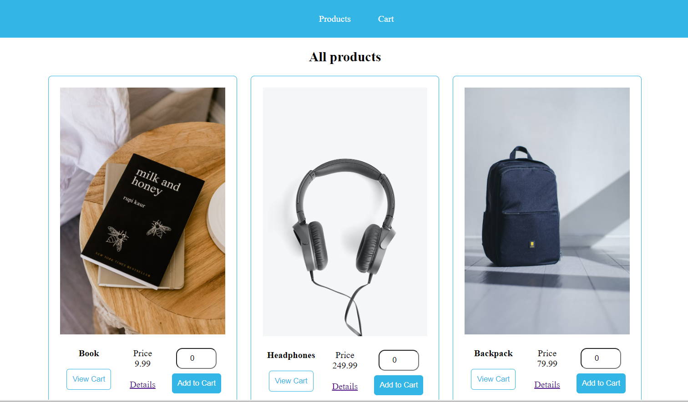

# Store Front

This project is a simple e-commerce website. 
Users are able to add products to cart, view details of products, edit cart and place orders for products selected.

## Getting started

### Prerequisites

You should have `npm` installed on your machine.

### Installation
1. Clone or fork project.
2. Run `npm install` to install all packages.
3. Run `npm run start` or `ng serve` to start development server. Server runs on `http://localhost:4200/`  
4. Open `http://localhost:4200/` in your prefered browser to view application.

### Built With

[![Angular][Angular.io]][Angular-url]

## Build

Run `npm run build` or `ng build` to build the project. The build artifacts will be stored in the `dist/` directory.

## Further help

To get more help on the Angular CLI use `ng help` or go check out the [Angular CLI Overview and Command Reference](https://angular.io/cli) page.
